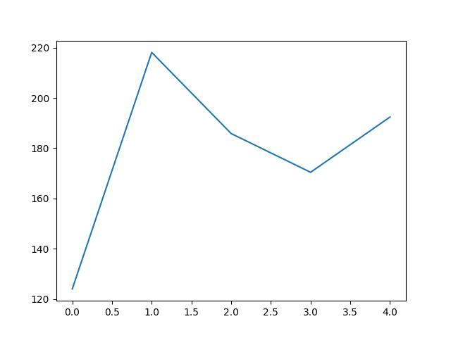
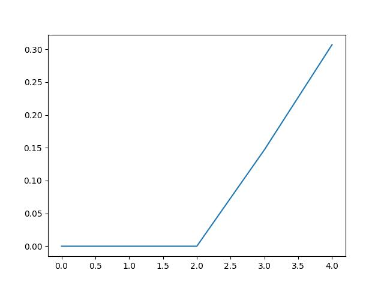
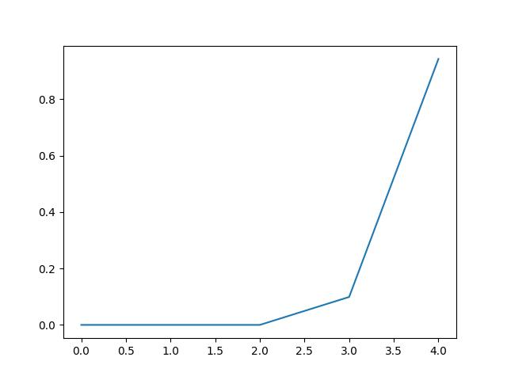
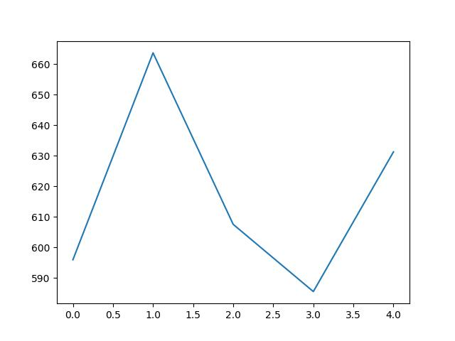
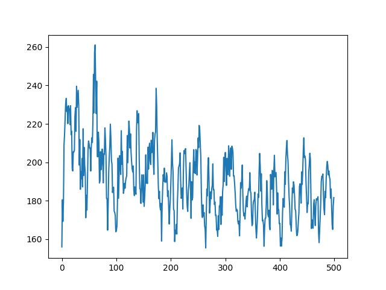
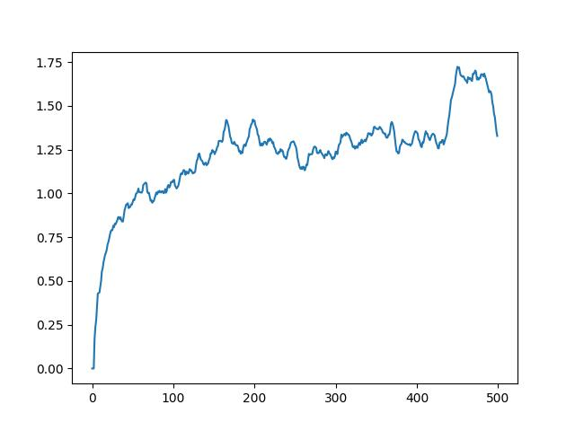
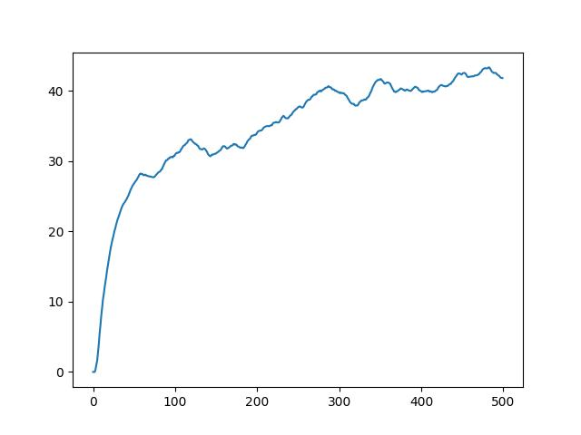
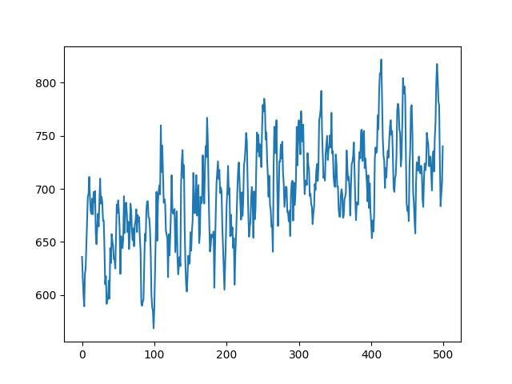

# REPORT

## *Part 1 : 补全的函数*

### *1. `td_estimate`*

相当于当前网络的打分，实现想法见注释 ：

```
def td_estimate(self, state, action):
        """
        根据 online 网络返回当前 batch 的 Q(s, a)。
        提示：online 网络算 Q 值表，再按 action 取对应分数。见 ASSIGNMENT.md。
        """

        # 1. 将当前状态输入 online 网络，得到所有动作的 Q 值
        current_q_values = self.net(state, model="online")
        # 2. 根据实际执行的 action，提取对应的 Q(s, a) 值
        # np.arange(0, self.batch_size) 遍历每一行，按action进行对应提取
        current_q = current_q_values[np.arange(0, self.batch_size), action]
        return current_q
```

### *2. `td_target`*

想法见注释 ：

```
@torch.no_grad()
    def td_target(self, reward, next_state, done):
        """
        根据 DQN 目标公式计算 TD target。
        提示：target 网络算 next_state 最高分，再写 return 公式。见 ASSIGNMENT.md。
        """

        # 1. 使用 target 网络计算下一状态的所有动作 Q 值
        next_q_values = self.net(next_state, model="target")
        # 2. 取下一状态的最大 Q 值 (max Q_target(s', a'))
        next_q = next_q_values.max(dim=1)[0]
        # 3. 根据 DQN 公式计算 TD Target
        # 如果 done 为 True (即 done.float()=1)，则 (1-done)=0，后续 Q 值不计入
        # 如果 done 为 False (即 done.float()=0)，则加上 gamma * next_q
        return (reward + (1 - done.float()) * self.gamma * next_q).float()
```

### *3. `update_Q_online`*

完成参数更新，实现方法见注释：

```
def update_Q_online(self, td_estimate, td_target):
        """
        使用 `self.loss_fn`、`self.optimizer` 完成一次参数更新。
        提示：loss_fn → zero_grad → backward → step → return loss.item()。
        """

        # 1. 计算 TD Estimate 和 TD Target 之间的损失
        loss = self.loss_fn(td_estimate, td_target)
        # 2. 清空过往梯度
        self.optimizer.zero_grad()
        # 3. 反向传播计算梯度
        loss.backward()
        # 4. 更新 online 网络参数
        self.optimizer.step()
        # 5. 返回标量形式的 loss 值，方便后续记录
        return loss.item()
```

## *Part 2 : TD target 计算方式*

依照贝尔曼最优方程：

$$
Y_t = R_{t+1} + \gamma \cdot \max_{a'} Q(S_{t+1}, a'; \theta^-)
$$

如果游戏结束，那么没有未来收益，公式变为：
$$
Y_t = R_{t+1}
$$
我们使用`1-done.float()`来控制后面的项，如果结束，`done.float() = 1`

在这里我们 return 的内容事实上就是贝尔曼最优方程 ：`reward + (1 - done.float()) * self.gamma * next_q`

## *Part3 : 程序运行情况与结果*

### 1. 首先是环境配置：

依据 `environment.yml`，我做了微调：

torch 版本 2.11.0+cu128，torchvision 版本0.26.0+cu128 适配显卡

其余均按照文件版本配置。

### 2. 然后是第一次实验（episodes=100,time=20min）

`python main.py --episodes 100 --gpu 0 `

`episodes = 100`仅仅是个热身

结果：

- 平均步数：



显然波动明显，早期随即探索不同的动作，纯看运气，而且此时轮次少，并没有很有效的经验

- 平均损失



前面经验池没有攒够数据，网络还没有开始训练，所以是 0。从60回合开始上升，说明开始训练了。

- 平均Q值



前期为0，后期攀升。上升说明他觉得自己处于某种有价值的状态，但是初期大概率是虚高，很常见

- 累计分数



分数在600分左右，相当于只是开始的一小段，处于早期。

### 3. 第二次实验（episodes=10000,time=6h）

- 平均步数



根据这个结果，我们可以分成几个部分：
- 探索期（前2000回合）：曲线剧烈震荡，甚至出现接近260的尖峰。这对应了DQN算法初期的ϵ -greedy高随机探索阶段。尝试各种动作组合，那个尖峰可能是陷入了某种循环。

- 策略形成期（2000-6000回合）：虽然仍有波动，但整体重心开始下移。开始对动作和正向奖励之间的关联有了一定的认识，应该是学会了基本的避障和赶路技巧。

- 收敛期（6000-10000回合）：数据分布更加紧凑，均值稳定在170-190区间。这说明智能体能够稳定地执行高效策略。不过，曲线仍然震荡，结合此时的ϵ是0.6左右，还是有随机探索的成分。

- 损失函数



这个损失函数不是很乐观啊。

虽然length有下降趋势，但是损失函数仍在上升，甚至有骤增的现象，说明此时还仍在调整期，还没有很好的收敛。

- Q值



Q值不断增长，说明他对自己得分的期望有所提高

- 奖励



奖励曲线的重心不断上移，下限也在增长，说明智能体切实的能力增长，
但是锯齿状震荡还是非常明显，随即探索的概率值还是很高，回合数仍然可以在增加。

综合上述四幅图的结果，虽然还没有到非常乐观的收敛结果，但是已经有了学习的进步，后续可以进一步增加回合数。


